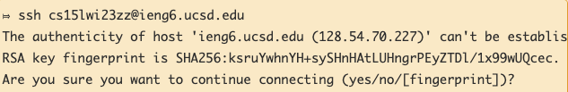

# Lab Report 1
## This is a tutorial for future 15L students about how to log into a course-specific account on ieng6.

*  ### __Step 1: Installing VScode__

    * Download VScode at [here](https://code.visualstudio.com/), and fellow the instruction to complete installation.

    * Once you done with installation and open the VScode you should see this
    
    

* ### __Step 2: Remotely Connecting__

    * To connect to a remote computer type this code `ssh cs15lwi23zz@ieng6.ucsd.edu` in your VScode terminal (Note:  `zz` replaced by the letters in your course-specific account)

    * If you are the first time connected to this server,you will probably get a message like this
    
    
    
    * type `yes` then press enter

    * Enter your password, if you connected to the server successfully you will see like this:(Note: the password won't show up for privacy)
    
    
    
* ### __Step 3: Trying Some Commands__

    * Try running the commands `cd`, `ls`, `pwd`, `mkdir` etc.
      * `cd` -- short for Change directory and it will take you from your current directory to another
      *  `ls` -- presents you the contents of the directory you're currently in. It will present you with both the files and other directories your current directory contains.
      *   `pwd` -- writes to standard output the full path name of your current directory (from the root directory). All directories are separated by a / (slash). The root directory is represented by the first /, and the last directory named is your current directory.
      *   `mkdir` -- stands for make directory and it will create a new directory for you. You have to pass the command the directory name parameter.
    
    
    
    * If you want to log out of the remote server in your terminal, you can use:
    
        1. Ctrl-D
        1. Run the command `exit`

