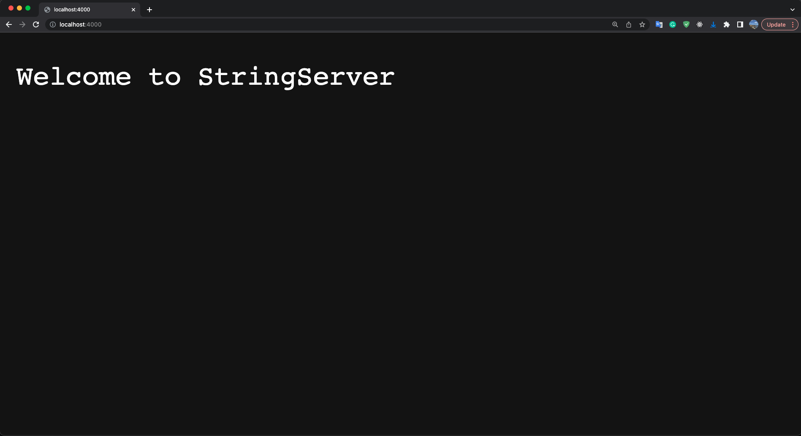
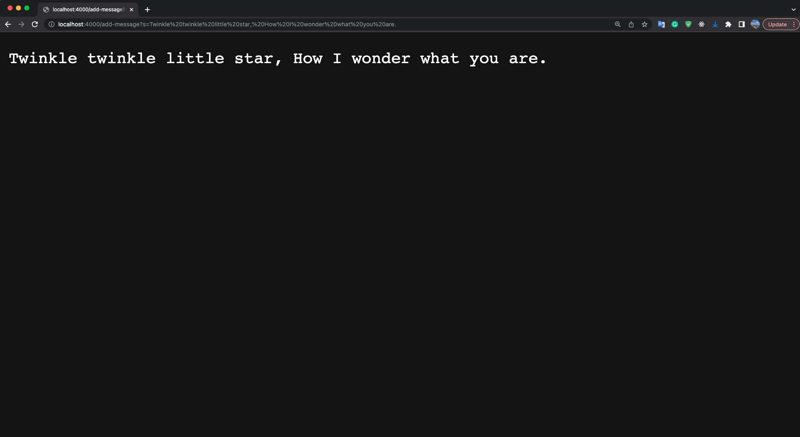
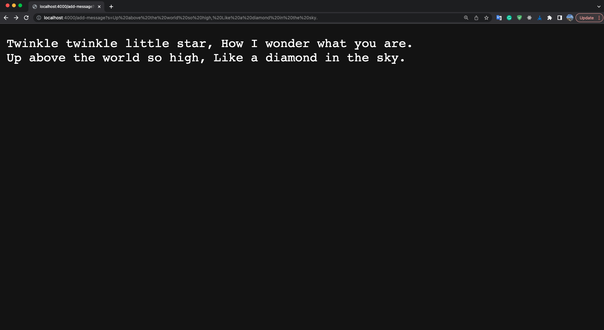
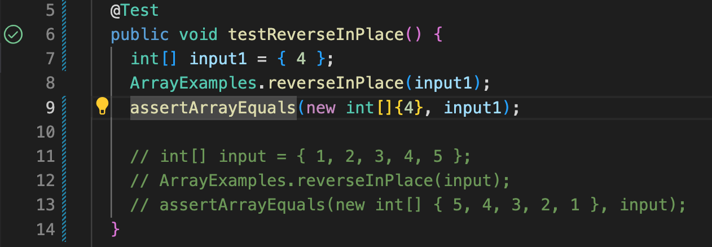
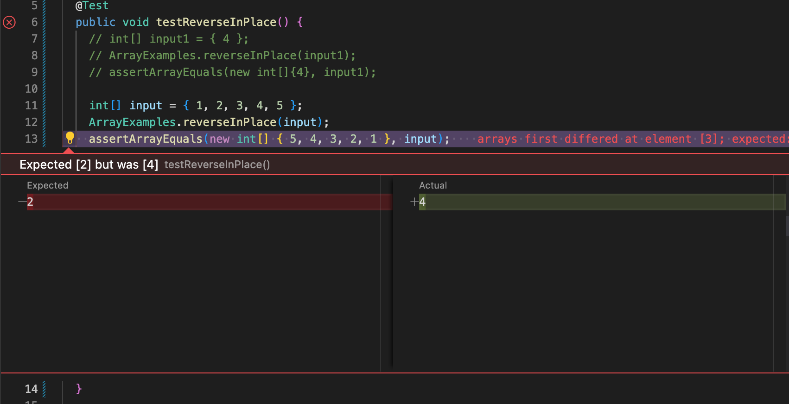

# Lab Report 2
## Part 1: StringServer
### Below is my code for StringServer.

```java
import java.io.IOException;
import java.net.URI;
import java.util.ArrayList;

class Handler implements URLHandler {

    ArrayList<String> strList = new ArrayList<>();
    String output = "";
    public String handleRequest(URI url) {
        if (url.getPath().equals("/")){
            return "Welcome to StringServer";
        } else if (url.getPath().contains("/add-message")) {
            String[] parameters = url.getQuery().split("=");
            if (parameters[0].equals("s")) {
                strList.add(parameters[1]);
                for (int i = 0; i < parameters.length; i++) {
                    if (i == 0){
                    } else {
                        output += parameters[i] + "\n";
                    }
                }
                return output;
            }
        }
        return "404 Not Found!";
    }
}

class StringServer {
    public static void main(String[] args) throws IOException {
        if (args.length == 0) {
            System.out.println("Missing port number! Try any number between 1024 to 49151");
            return;
        }
        int port = Integer.parseInt(args[0]);
        Server.start(port, new Handler());
    }
}
```

### when I run StringServer.java at port 4000, this screen will shown as below. 

* The method it was called is `public String handleRequest(URI url)` 
* The argument for this method is URI with no path
* With no path the code will excute the `if` statement print out "Welcome to StringServer"



### when I change url to add messages the screen show below

* The method it was called is`public String handleRequest(URI url)` 
* The argument for this method is URI with path to add-message
* With add-message path found the code will excute `else if` statement and add the message into strList, then loop for strList concast all the message to outcome with with new line beteew each of them, last print the outcome to screen



### when I coutinue to add message the screen shown below

* The method it was called is `public String handleRequest(URI url)` 
* The argument for this method is URI with no path
* With add-message path found the code will excute `else if` statement and add the message into strList, then loop for strList concast all the message to outcome with with new line beteew each of them, last print the outcome to screen



    

## Part 2: choose one of the bugs from lab 3

### I choose the method `reverseInPlace(int[] arr)` in class `ArrayExamples`

```java
public class ArrayExamples {

  // Changes the input array to be in reversed order
  static void reverseInPlace(int[] arr) {
    for(int i = 0; i < arr.length; i += 1) {
      arr[i] = arr[arr.length - i - 1];
    }
  }

  ...
}
```

* The failure-inducing input I use is {1,2,3,4,5}, code for junit shown below

```java
int[] input = { 1, 2, 3, 4, 5 };
ArrayExamples.reverseInPlace(input);
assertArrayEquals(new int[] { 5, 4, 3, 2, 1 }, input);
```

* Input that doesn’t induce a failure is {4}, code for junit shown below

```java
int[] input1 = { 4 };
ArrayExamples.reverseInPlace(input1);
assertArrayEquals(new int[]{4}, input1);
```

* The symptom, as the output of running the tests 

    * For input {4} the screenshot of output is shown below， it pass the test
    

    * For input {1,2,3,4,5} the screenshot of output is shown below， it fails the test
    

### The fixed code is shown below

* Code with bug

```java
static void reverseInPlace(int[] arr) {
    for(int i = 0; i < arr.length; i += 1) {
        // reverse array with wrong way
        arr[i] = arr[arr.length - i - 1];
    }
  }
```

* The fixed code

```java
 static void reverseInPlace(int[] arr) {
    
    int[] tArr = new int[arr.length];
    for (int i = arr.length-1; i >=0; i--){
      tArr[arr.length - 1 -i] = arr[i];
    }
    for (int i = 0; i < arr.length; i++){
      arr[i] = tArr[i];
    }
}
```


### The original code reverse array with wrong way, because When the loop pass the middle index the original data before the moddle point has been covered. The fixed code using a temp to store the original array data inorder to prevent overwritting.


## Part 3: Something I learn form lab 2 and 3

1. To write a sample http web sever in java
1. To highlight code in markdown code block


    

       

