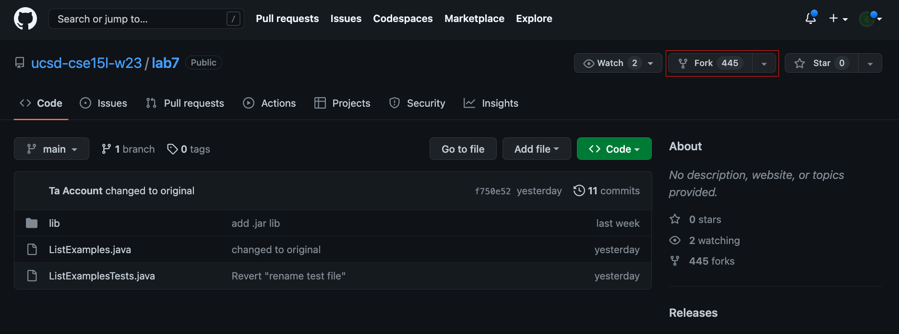
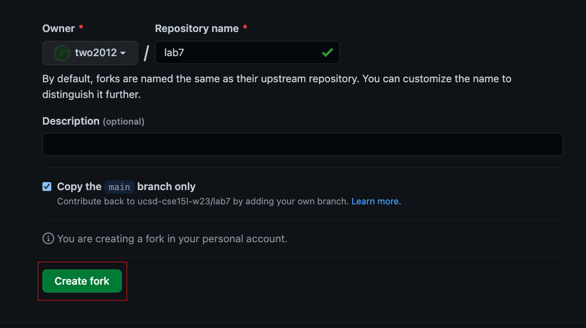
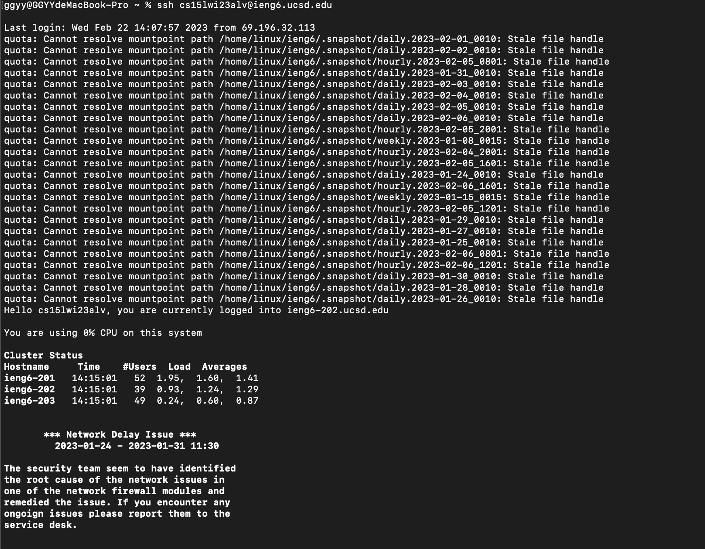
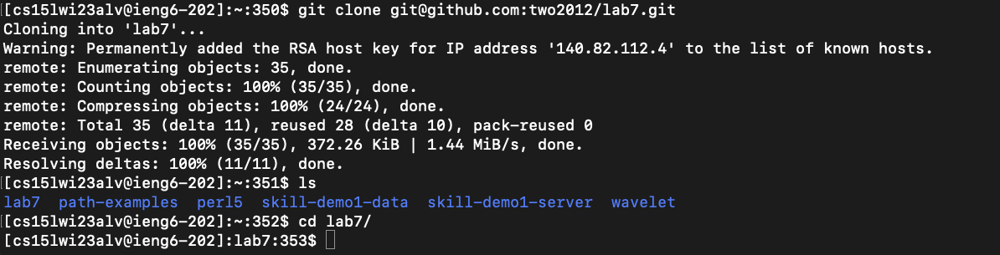
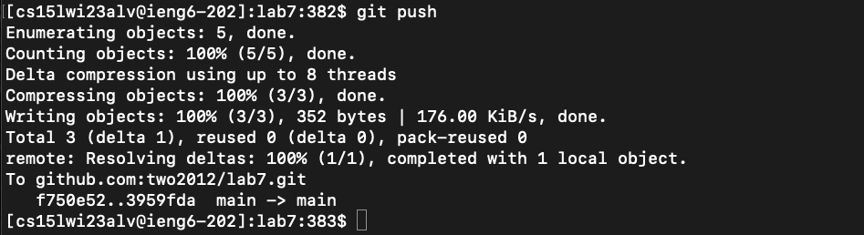

# Lab Report 4

### 1. Setup Delete any existing forks of the repository you have on your account 

* `rm -rf lab7 # remove existing lab7 floder`
* `<enter>`
* `ls` 
* `<enter>`

    

### 2. Setup Fork the repository

   

   

### 3. The real deal Start the timer!

### 4. Log into ieng6

* `ssh cs15lwi23alv@ieng6.ucsd.edu`
* `<enter>`

    

### 5. Clone your fork of the repository from your Github account

* `git clone git@github.com:two2012/lab7.git`
* `<enter>`
* `ls`
* `<enter>`
* `cd l<tab>`

    

### 6. Run the tests, demonstrating that they fail

* `javac -cp .:lib/hamcrest-core-1.3.jar:lib/junit-4.13.2.jar *.java`
* `<enter>`
* `java -cp .:lib/hamcrest-core-1.3.jar:lib/junit-4.13.2.jar org.junit.runner.JUnitCore L<tab>T<tab>`
* `<enter>`

    

### 7. Edit the code file to fix the failing test

* `nano L<tab>.j<tab>`
* `<enter>`

    

* `<ctrl> + <w>`
* `result.add`
* `<enter>`
* `<right> x 13`
* `<back> x 3`
* `<ctrl> + <w>`
* `index1 += 1;`
* `<enter>`
* `<right> x 6`
* `<back>`
* `2`
* `<ctrl> + <o>`
* `<enter>`
* `<ctrl> + <x>`

### 8. Run the tests, demonstrating that they now succeed

* `<up> x 3`
* `<enter>`
* `<up> x 3`
* `<enter>`

    

### 9. Commit and push the resulting change to your Github account

* `git add L<tab>.j<tab>`
* `<enter>`
* `git commit -m "fixed"`
* `<enter>`

    

* `git push`
* `<enter>`

    

