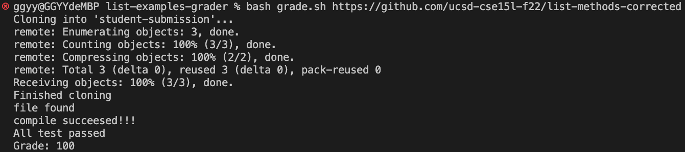
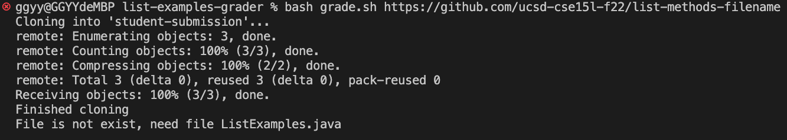
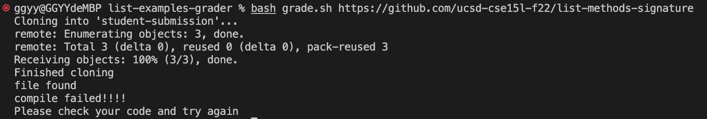
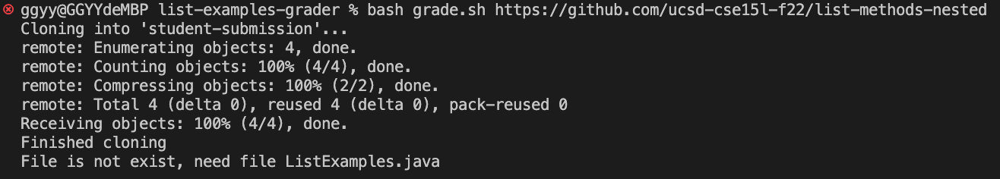
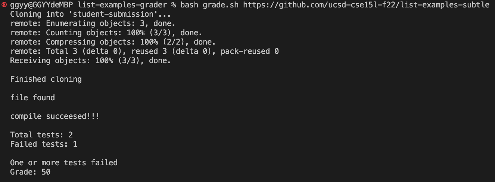
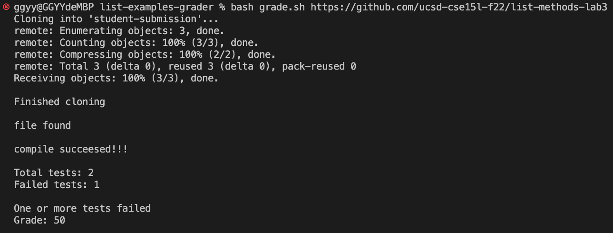

# Lab Report 5

## complete the grade script from lab 6

### I completed the grade script from lab 6. I added `grep` command to find out total test runs and total test failures. and calculate the grade based on the total test runs and total test failures. my code is below:

```bash

CPATH='.:lib/hamcrest-core-1.3.jar:lib/junit-4.13.2.jar'
rm -rf student-submission
git clone $1 student-submission

echo ""
echo 'Finished cloning'
echo ""

cp -r lib student-submission
cp TestListExamples.java student-submission

cd student-submission
if [[ -f ListExamples.java ]]
then 
    echo "file found"
    echo ""
else 
    echo "File is not exist, need file ListExamples.java"
    echo ""
    exit 1
fi

javac -cp $CPATH *.java 2>compile.txt
if [[ $? -eq 0 ]]
then 
    echo "compile succeesed!!!"
    echo ""
else
    echo "compile failed!!!!"
    echo "Please check your code and try again"
    echo ""
    exit 1
fi

java -cp $CPATH org.junit.runner.JUnitCore TestListExamples >output.txt
if grep -q "OK" output.txt ;
then
    echo "All test passed"
    echo "Grade: 100"
    exit 1
else
    TOTALTESTS=$(grep -o "Tests run: [0-9]*" output.txt | grep -o "[0-9]*")
    FAILEDTESTS=$(grep -o "Failures: [0-9]*" output.txt | grep -o "[0-9]*")
    echo Total tests: $TOTALTESTS
    echo Failed tests: $FAILEDTESTS
    echo ""
    PASSEDTESTS=$((TOTALTESTS - FAILEDTESTS))
    GRADE=$((PASSEDTESTS * 100 / TOTALTESTS)) 
    echo "One or more tests failed"
    echo Grade: $GRADE
    echo ""
    exit 1
fi

```

### Demonstration of it working on several files
    
1. All method are correct

    

2. Has a great implementation saved in a file with the wrong name

    

3. Has the types for the arguments of filter() in the wrong order, so it doesn’t match the expected behavior

    

4. Has a great implementation saved in a nested directory called pa1

    

5. With bad implementation

    

6. With bad implementation

    


### Conclusion

The `grade.sh` is work correctly. It can give prompt message for compile failed, missing file, and calculate the grade. However it can not give the prompt message for the wrong implementation, also for different situation it may given same prompt message like situation (2) and (4).